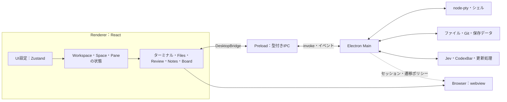

# アーキテクチャ

VINTAGEはElectron、React、xterm.js、node-ptyで構成するローカルのターミナルWorkspaceアプリです。この文書は現在のソースコードを対象に、プロセスの責務、状態の所有者、保存形式、外部連携を説明します。操作方法と画面例は[機能と画面のガイド](FEATURES_JP.md)、Boardの外部更新仕様は[KanbanのAI連携と保存形式](KANBAN.md)を参照してください。

## 全体構成



Rendererは表示とユーザー操作を担当し、OSへのアクセスはPreloadの`DesktopBridge`経由でMainへ渡します。MainがWorkspaceの実パス、PTY、ファイル操作、Git、資格情報、更新処理を管理します。Browserの外部ページは別のWebContentsとセッションで実行します。

## ディレクトリと責務

| 場所                                                                | 主な責務                                                                                |
| :------------------------------------------------------------------ | :-------------------------------------------------------------------------------------- |
| [`src/main/index.ts`](../src/main/index.ts)                         | アプリ起動、ウィンドウ、Workspace登録、Desktop IPC、プレビュープロトコル、通知          |
| [`src/main/terminalManager.ts`](../src/main/terminalManager.ts)     | PTY作成、入力・出力・サイズ、所有者検証、再接続、終了処理                               |
| [`src/main/attentionRouter.ts`](../src/main/attentionRouter.ts)     | シェル・出力・プロセス・Jevの結果を統合した端末状態の判定                               |
| [`src/preload/index.ts`](../src/preload/index.ts)                   | 許可した操作とイベントだけをRendererへ公開                                              |
| [`src/shared/desktop.ts`](../src/shared/desktop.ts)                 | IPCチャンネル、DesktopBridge、イベント・保存データの型、共通上限                        |
| [`src/shared/kanban.ts`](../src/shared/kanban.ts)                   | Boardの型とドキュメント検証                                                             |
| [`src/renderer/App.tsx`](../src/renderer/App.tsx)                   | Workspace・Space・Pane、配置、画面遷移、Attention一覧、ショートカット、コマンドパレット |
| [`src/renderer/store/uiStore.ts`](../src/renderer/store/uiStore.ts) | UI設定、ペイン表示、Notes・BoardのON/OFF、Browserタブ、キー割り当て                     |
| `src/renderer/components/`                                          | ターミナル、ファイルビューアー、右ペイン、設定画面などのReactコンポーネント             |

`src/main`はElectronとNode.jsを利用できますが、Rendererの実装をimportしません。`src/preload`もRendererをimportしません。`src/renderer`はブラウザーAPIと共有コードを使い、ElectronやNode.jsを直接importしません。`src/shared`にはプロセス間で共有する型・定数・検証処理を置きます。

### 残っているWorkspaceAdapter層

[`WorkspaceController`](../src/renderer/runtime/WorkspaceController.ts)、[`WorkspaceProvider`](../src/renderer/runtime/WorkspaceProvider.tsx)、[`WorkspaceAdapter`](../src/shared/workspace.ts)は、タスク・会話・Activityを扱うモック連携用の層です。`main.tsx`では現在もモックAdapterをProviderへ渡しています。

デスクトップのWorkspace・Space・PaneやPTYは、このControllerを経由しません。Workspaceの画面状態は`App.tsx`、ネイティブ機能は`DesktopBridge`とMainの各サービスが担当します。モック層の`WorkspaceTask`と、デスクトップの`RegisteredWorkspace`は別のモデルです。

## IPCとネイティブ機能の境界

`DesktopChannels`と`DesktopBridge`を共有契約として、Preloadが個別の`ipcRenderer.invoke`とイベント購読を公開します。Rendererに汎用のIPC送信関数やNode.jsのハンドルは渡しません。イベント購読は解除関数を返し、コンポーネントの終了時に解除します。

型定義だけではIPC入力の正当性を保証できないため、MainでもID、文字列、サイズ、保存形式、パスなどを検証します。ウィンドウ操作や書き込みを伴うDesktop IPCでは送信元ウィンドウを検証し、PTY操作ではセッションの所有者と`event.sender.id`を照合します。ファイル読み取りも登録済みWorkspaceと実パスの境界を通します。

メインウィンドウは`contextIsolation: true`、`nodeIntegration: false`、`sandbox: true`です。トップレベルの遷移は開発サーバーまたはRenderer自身のエントリーに限定し、外部リンクは許可したスキームだけをOSへ渡します。

## Workspace・Space・Paneの状態

WorkspaceはHomeまたはProjectのフォルダーに対応します。Projectはフォルダー選択で登録し、MainがIDと実パスの対応を保持します。Rendererは実行中の画面状態としてWorkspace一覧、選択中のSpace、Pane、分割ツリーを保持し、スナップショットをMainへ保存依頼します。

分割ツリーは配置情報として使い、実際のPaneは安定したPane IDをキーにして同じ階層へ絶対配置します。分割やサイズ変更でReactツリーを組み替えて端末を再作成しないための構造です。非選択のSpaceも表示状態を切り替えて保持します。

共通上限は`WORKSPACE_LIMITS`で定義し、Rendererの操作とMainの保存検証で共有します。

| 対象               | 上限 |
| :----------------- | :--- |
| Workspace内のSpace | 256  |
| Space内のPane      | 64   |
| 分割ツリーの深さ   | 8    |

[`workspaceState.ts`](../src/main/workspaceState.ts)はスナップショットの形式、ID参照、配置、上限を検証します。保存はまとめて行い、一時ファイルから置き換えます。アプリ終了前にも未保存の状態をflushします。[`workspaceRestore.ts`](../src/main/workspaceRestore.ts)はProjectの存在を確認し、見つからない場合も保存済みの配置を保持して、再指定または削除できるようにします。

## ターミナルのライフサイクル

### 作成とデータの流れ

```text
作成：TerminalPanel → DesktopBridge → terminalManager → node-pty → シェル
入力：xterm.js → Preload invoke → 所有者検証 → PTY.write
出力：PTY → Mainのまとめ送信 → Preloadイベント → xterm.js
監視：PTY出力・シェルイベント・プロセス情報 → AttentionRouter → Renderer
```

PTYはMainの`terminalManager.ts`だけが所有します。Rendererが渡すWorkspace IDから作業ディレクトリを解決し、[`shellResolver.ts`](../src/main/shellResolver.ts)でシェルを選択します。[`shellIntegration.ts`](../src/main/shellIntegration.ts)はzsh・bash・fish向けの一時的な統合を用意し、OSC 133のコマンド開始・終了とOSC 7の作業ディレクトリ情報を出力させます。

Rendererはイベント購読とxterm.jsの準備後に`readyTerminal`を呼びます。それまでの出力はMainでバッファリングし、購読前の出力が欠ける競合を防ぎます。準備後のPTY出力は8 msの窓、または512 Ki文字のしきい値でまとめてIPC送信します。

[`TerminalPanel.tsx`](../src/renderer/components/TerminalPanel.tsx)はxterm.jsとFit、検索、リンク、画像などのAddonを管理します。表示中のSpaceでは先頭8 PaneまでWebGLを利用でき、それ以外やWebGLの利用失敗時はDOM描画を使います。WebGLの有効状態をフォーカス切り替えに連動させず、Paneの表示・配置と端末セッションを維持します。

### 再読み込みと終了

Rendererの再読み込みやクラッシュ時には、Main側のPTYを終了せず、セッションを未接続状態にします。同じWebContentsの安定したPane IDで再接続し、[`ptyReplayBuffer.ts`](../src/main/ptyReplayBuffer.ts)に保持した直近の出力を、新しい出力より先に送ります。タイトル変更は再接続の照合に影響しません。

明示的に端末を閉じた場合、PTYが終了した場合、所有するWebContentsが破棄された場合には、PTY・監視・シェル統合を片付けます。アプリ終了後にPTYや端末出力を復元する仕組みはなく、再起動では保存済み配置に新しいシェルを起動します。

### クリップボード

テキストのコピー・貼り付けはMainのクリップボードAPIを使います。画像の貼り付けはPNGをアプリの一時領域へ保存し、CLIに渡すファイルパスをRendererへ返します。画像は25 MiBまでで、Workspaceごとに保存先を分け、保存数と保持時間に基づいて整理します。プロジェクトへ貼り付け画像を自動配置しません。

## Attentionと外部連携

### 状態判定と通知

`AttentionRouter`はシェルイベント、端末出力、入力、前景プロセスを統合します。[`processMonitor.ts`](../src/main/processMonitor.ts)は複数セッションで共有するプロセス監視を提供します。Jevは必要に応じて意味判定を補います。

端末ごとの監視モードとアプリ共通のしきい値・間隔は[`attentionSettings.ts`](../src/main/attentionSettings.ts)が管理し、設定変更を実行中の端末にも配信します。監視モードの保存キーはWorkspaceパス、Space名、端末名のハッシュです。セッション再接続に使うPane IDとは役割が異なります。

Rendererは端末状態をPaneへ対応付け、SpaceとWorkspaceのドットに集約し、Attention一覧・履歴・トーストを表示します。Attentionを選ぶとWorkspace、Space、Paneへ移動します。OSのデスクトップ通知はMainが作成し、重複と頻度を制限します。モードの細かな判定仕様は[AttentionRouter設計](AttentionRouter.md)にあります。

### Jev

[`jevEvaluationQueue.ts`](../src/main/jevEvaluationQueue.ts)はアプリ共通の優先度付きキューです。同じ端末の待機要求をまとめ、並列数・キュー長・端末ごとの間隔・毎秒／毎分の呼び出し数を制限します。設定変更時には古い要求を無効化します。

[`jevJudge.ts`](../src/main/jevJudge.ts)がTypeSafe SDKを呼び出し、キャッシュとローカル判定を併用します。送信する端末出力は末尾40行・最大4,000文字に制限し、秘密情報と考えられる値をマスキングします。タイムアウトやサービス障害で端末入出力を止めません。

[`jevSettings.ts`](../src/main/jevSettings.ts)はAPIキーをMainだけで扱います。保存済みキーはElectronの`safeStorage`で暗号化し、安全なバックエンドが利用できない場合は新規保存を拒否します。`TYPESAFE_API_KEY`による設定にも対応し、保存済みキーが優先されます。Rendererにはキーの値ではなく設定状態を返します。

### CodexBar

[`codexbarClient.ts`](../src/main/codexbarClient.ts)がローカルのCodexBar CLIを検出・実行し、ダッシュボード結果を共有型へ変換します。CLI実行は引数配列とタイムアウトで制御します。VINTAGE自身がUsage取得のために各AIプロバイダーAPIを呼び出す構造ではありません。

[`UsagePanel.tsx`](../src/renderer/components/UsagePanel.tsx)が表示中に設定した間隔で更新し、手動更新にも対応します。Provider設定と認証はCodexBar側が管理します。

## Files・プレビュー・Git Review

### ファイル操作とパス境界

Filesは選択中のWorkspaceを閲覧し、展開したフォルダーだけを遅延読み込みします。読み取りはMainで`realpath`を解決し、Workspace外の実パスを拒否します。

[`FileActions.tsx`](../src/renderer/components/FileActions.tsx)と[`workspaceFileOperations.ts`](../src/main/workspaceFileOperations.ts)がコピー、貼り付け、リネーム、名前・相対パス・フルパスのコピーを提供します。コピー元のWorkspace IDと相対パスは`SidePane`内に保持し、OSのファイルコピー用クリップボードとは連携しません。別の登録済みWorkspaceへも貼り付けられます。

書き込みを伴う操作ではWorkspaceルートの変更、パスの逸脱、シンボリックリンクを拒否します。フォルダーコピーは子孫の種類も検証し、自分自身へのコピーを拒否します。同名項目は上書きせず、Mainで発生したエラーを操作メニューに表示します。

### プレビューとMarkdown編集

[`FileViewer.tsx`](../src/renderer/components/FileViewer.tsx)が形式に応じてプレビューを選びます。テキストは1 MB、画像は10 MB、HTMLとCSSは5 MBの読み取り上限をMainに設けています。

画像・HTML・メディアなどは`vintage-preview:`プロトコルで提供し、リクエストごとにWorkspaceとファイルを再検証します。HTML・SVGの応答にはスクリプト、外部接続、フォームなどを制限するCSPを付けます。PDFは検証済みファイルのURLを組み込みビューアーへ渡す別経路です。

Markdownは[`MarkdownEditor.tsx`](../src/renderer/components/MarkdownEditor.tsx)でPreviewとEditを切り替えます。[`markdownSave.ts`](../src/main/markdownSave.ts)がファイルごとの保存を直列化し、読み取り時の内容と現在の内容が一致することを確認してから書き込みます。競合時は保存を拒否し、Rendererの下書きを保持します。

### Git Review

[`workspaceGitReview.ts`](../src/main/workspaceGitReview.ts)はGitコマンドをMainで実行し、未ステージ・ステージ済みの変更、未追跡ファイル、ブランチ比較と差分を取得します。Gitへの引数は配列で渡し、タイムアウトと出力上限を設け、外部diffやtextconvなどの影響を制限します。

[`ReviewPane.tsx`](../src/renderer/components/ReviewPane.tsx)はLocal ChangesとBranch Diffを切り替え、選択中のファイル差分を表示します。Stage、Commitなどの書き込み操作は提供しません。

### 自動更新

FilesとReviewは右ペインが表示され、対象タブがアクティブな間だけ、前回の読み込み完了から3秒後に再取得します。展開フォルダーと選択中の差分を保持します。古い非同期応答はキャンセル状態や要求世代で除外します。

開いたドキュメントはMainのファイルバージョン情報を比較し、表示中に変更があった場合だけ内容を読み直します。Markdownでは未編集のPreviewに限定し、Edit表示中や未保存の変更がある間は自動更新しません。

## NotesとBoard

[`NotesPane.tsx`](../src/renderer/components/NotesPane.tsx)は独立したNotes・Boardタブの内容を管理します。NotesはMarkdownEditorをパスなしで使うScratchpadで、入力時にRendererのlocalStorageへ保存します。Markdownファイルの書きかけも同じ保存方式です。メモと下書きは暗号化していません。

Notesの`.md`書き出しはMainの保存ダイアログを使い、Workspace内の新規ファイルだけを作成します。既存ファイルは上書きしません。Notesの選択文または現在行からカード作成フォームを開く処理はRenderer内で行います。

Boardの正本はlocalStorageではなく、Mainが管理するJSONファイルです。[`kanbanStore.ts`](../src/main/kanbanStore.ts)はWorkspaceの実パスをハッシュ化して保存領域を分け、ドキュメントを検証します。書き込みはロック取得、最新revisionの確認、一時ファイル作成、置き換え、ロック解放の順で行います。revisionは内容のハッシュで、古い状態からの保存を拒否します。

[`KanbanBoard.tsx`](../src/renderer/components/KanbanBoard.tsx)は表示中だけ3秒ごとに外部更新を確認します。カード編集中の下書きは保持し、競合を表示します。以前のlocalStorageカードは初回にJSONへ移行し、元データはバックアップとして残します。

[`kanbanInstructions.ts`](../src/main/kanbanInstructions.ts)と[`kanbanCli.ts`](../src/main/kanbanCli.ts)は、ボード／カードの保存先と作業指示をクリップボードへコピーし、Python更新ヘルパーをアプリ保存領域へ配置します。AIエージェントは利用者が指示を貼り付けて実行します。プロジェクト内に連携ファイルや環境変数を追加しません。

Notes・BoardのON/OFFは`uiStore`へ保存します。表示中のタブをOffにした場合はFilesへ移動し、保存済みメモとカードは保持します。各タブを開く操作とON/OFFには別のShortcutActionを用意し、設定画面とコマンドパレットで共有します。

## Browserの隔離

[`BrowserPane.tsx`](../src/renderer/components/BrowserPane.tsx)は複数のwebviewタブとアドレス表示を管理します。アドレス欄の正規化はUI処理であり、許可判断はMainでも行います。

[`webviewSecurity.ts`](../src/main/webviewSecurity.ts)がゲストの生成と遷移ポリシーを担当します。許可URLはHTTP、HTTPS、`about:blank`に限り、ゲスト側のPreloadを除去してNode.jsを無効化し、sandbox・contextIsolation・webSecurityを有効にします。ゲストはDesktopBridgeへアクセスできません。

Browserは`persist:starter-browser`の専用セッションを共有し、アプリのRendererセッションと分離します。権限要求は拒否し、新規ウィンドウは生成せず、許可URLを同じゲストへ読み込みます。メインウィンドウの遷移制限は[`windowNavigation.ts`](../src/main/windowNavigation.ts)が担当します。

## 保存データ

Main側の保存先は原則として`app.getPath("userData")`です。Renderer側のUI設定と下書きはlocalStorageに置きます。

| データ                | 保存先・所有者                                                                   | 保存する内容                                                       |
| :-------------------- | :------------------------------------------------------------------------------- | :----------------------------------------------------------------- |
| Workspace配置         | `userData/workspace-state.json`・Main                                            | Projectのパス、Space、Pane ID、分割配置、開いたファイルの相対パス  |
| Attention設定         | `userData/attention-settings.json`・Main                                         | しきい値、監視間隔、端末プロファイルのハッシュとモード             |
| Jev資格情報           | `userData/jev-credentials.json`・Main                                            | safeStorageで暗号化したAPIキー                                     |
| Board                 | `userData/kanban/<実パスのSHA-256>/kanban.json`・Main                            | カードID、タイトル、メモ、状態                                     |
| Board更新ヘルパー     | Boardと同じディレクトリの`update-card.py`・Main                                  | CLIエージェント向けの参照・更新処理                                |
| UI設定                | `ai-workspace-starter-ui`・Renderer localStorage                                 | テーマ、サイズ、シェル、ショートカット、各ペインの表示設定など     |
| Notes・Markdown下書き | `vintage:markdown:<Workspace ID>:<pathまたは:scratchpad>`・Renderer localStorage | 編集内容と読み取り時の内容                                         |
| Browserセッション     | Electronの専用persistent partition                                               | Browserゲストのセッションデータ                                    |
| PTY・直近の出力       | Mainのメモリー                                                                   | 実行中のプロセスとRenderer再接続用の出力。アプリ終了後は復元しない |

Workspace、Attention設定、Jev資格情報は一時ファイルから置き換え、保存ファイルの権限を`0600`に設定します。Boardもロックと一時ファイルの置き換えを使います。JSON保存の方式と、既存Markdownファイルへの内容比較付き書き込みは異なります。

## アプリ更新と再起動

[`updateManager.ts`](../src/main/updateManager.ts)がelectron-updaterの状態を共有型へ変換し、Rendererへ通知します。ダウンロードは明示操作で開始し、終了時の自動インストールは無効化しています。開発ビルドでは更新チェックを提供しません。

WindowsとLinuxのAppImageはダウンロード後にelectron-updaterで適用します。Linuxの`.deb`は[`debInstall.ts`](../src/main/debInstall.ts)の引数配列で`pkexec dpkg -i`を実行し、利用不可・失敗時はシステムのパッケージインストーラーへ渡します。インストーラーも利用できない場合は手動のインストールコマンドを表示します。macOSのダウンロードはReleaseページへの案内を使います。

通常の再起動は[`restartApp.ts`](../src/main/restartApp.ts)が担当します。LinuxではElectronの`app.relaunch()`による`NoNewPrivs`の継承を避けるため、アプリ終了後に別プロセスから同じ実行ファイルと引数を起動します。すでに`NoNewPrivs: 1`の場合は再起動を拒否し、デスクトップから起動し直す案内を返します。他OSでは`app.relaunch()`を使います。

## ビルドと検証

MainとPreloadは[`tsup.config.ts`](../tsup.config.ts)で、それぞれ`dist/main/index.js`（ESM）と`dist/preload/index.cjs`へ出力します。RendererはVite、React、Tailwind CSSで`dist/renderer/`へビルドします。electron-builderが対象OS向けパッケージを作成します。

```bash
pnpm verify:boundaries
pnpm verify
pnpm test:e2e
```

`verify:boundaries`は[`check-boundaries.mjs`](../scripts/check-boundaries.mjs)でプロセス間の禁止importを確認します。検査対象はソース中のimportパターンであり、IPC認可や実行時ポリシーの完全な検証を代替しません。`verify`は境界検査、型検査、lint、フォーマット検査、単体テスト、本番ビルドを実行します。

`test:e2e`は隔離プロファイルで実際のElectronを起動し、Home端末、入力、Renderer再読み込み後の再接続、設定画面などを確認します。配布済みアプリの更新・インストールや、外部CLI／AIサービスの実動作は別途確認が必要です。

ガイド用の画面は、ビルド後に`node scripts/capture-feature-screens.mjs`で再撮影できます。このスクリプトは一時的なサンプルProjectと隔離プロファイルを使い、実際のElectron画面を`assets/readme/`へ保存します。
