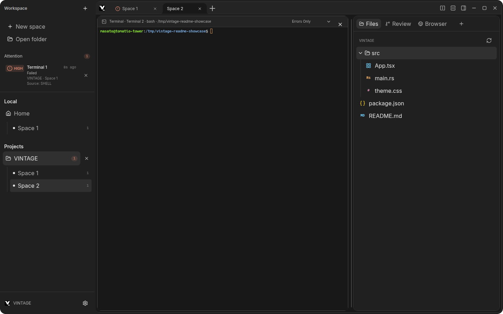
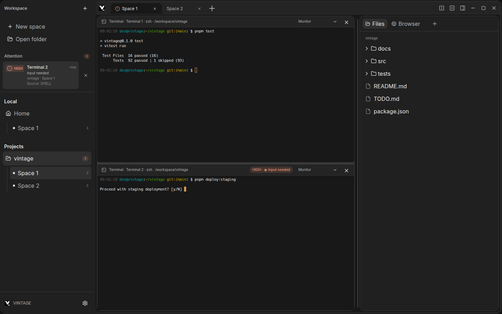
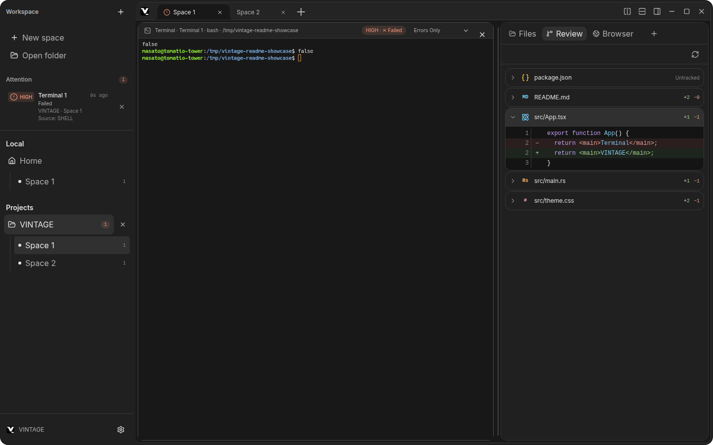

# Features and screens

English | [日本語](FEATURES_JP.md) | [README](../README.md)

This guide describes VINTAGE’s main screens and behavior in more detail. The [README](../README.md) has a short overview and setup instructions.

## Main window

The VINTAGE window is organized into three work areas:

- **Sidebar**: Workspace navigation, Spaces, and the Attention list for terminals that need a response.
- **Center**: Space tabs and terminal panes. Split a Space horizontally or vertically to work in multiple shells at once.
- **Right pane**: Switch between Files, Review, Usage, and Browser without replacing the active terminal layout.

_Sample workspace with an Attention item from another Space and language-specific icons in the Files pane._

### Return to a background terminal

Select an Attention item to open its workspace, Space, and terminal. The Review pane can stay open while you inspect the change that prompted the notification.

_Sample workspace after navigating to the terminal that needs attention._

## Workspaces, Spaces, and terminals

- VINTAGE starts in your home directory with `Space 1` and `Terminal 1` ready to use.
- Add a project with **Open folder**. The selected folder becomes the working directory for new terminals in that workspace.
- Create multiple Spaces per workspace and switch between them using tabs or keyboard shortcuts. A new Space starts with `Terminal 1`.
- Split the active terminal to the right or below. Close Spaces and panes with their close controls. Double-click a Space or terminal title to rename it; press `Enter` or move focus to save, or `Escape` to cancel.
- Choose zsh, bash, fish, or the operating system’s default shell. Selecting terminal output with the mouse copies it to the clipboard.
- Terminal sessions and their output are not restored after the app closes. Workspace and pane layout information is saved separately.

## Agent status at a glance

Space tabs and sidebar Workspace/Tab rows show a dot for the most urgent recognized terminal state across their panes. When a Space contains multiple panes, the dot summarizes the highest-priority state. Blue marks `Thinking`, green marks `Running` or `Completed`, yellow marks `Waiting` or `Input needed`, and red-orange marks `Warning` or `Failed`. Hollow dots indicate `Waiting` and `Warning`; pulsing dots indicate `Thinking`, `Running`, and `Input needed`. `Idle` and unclassified `Unknown` states have no dot.

## Command palette and quick switcher

Press `Ctrl+Shift+P` to open the palette. Search one input for actions, workspaces, Spaces, and terminal panes. The **All**, **Actions**, and **Locations** scopes narrow the results; use the arrow keys to move through the list (including each section's `Show N more` row, which `Enter` expands), `Tab` / `Shift+Tab` to switch scopes, `Enter` to select, and `Escape` to close.

The shortcut can be reassigned in **Settings → Shortcuts**. The palette is intended as a single entry point for navigation and app actions, so you do not need to memorize a separate shortcut for every destination.

## Right pane

### Files and previews

Open **Files** to browse the selected workspace. Double-click a file to open its preview beside the terminal area.

- **Markdown** supports workspace images and tables, with **Preview** and **Source** views.
- **JSON** supports formatted preview and raw source. **CSV/TSV** supports a searchable table and source view.
- **HTML** is shown in an isolated preview that blocks scripts and external resources; source view is also available.
- **Images** have zoom controls. **PDF** uses a built-in viewer, and audio and video have playback controls.
- Common source and text files use syntax highlighting. Search, line wrapping, copy, and reload controls depend on the file type and view.
- Unsupported formats, including Office documents and ZIP archives, can be opened in the system app.

Text previews are limited to 1 MB and the first 10,000 lines. Image previews are limited to 10 MB. HTML previews and their CSS resources are limited to 5 MB. Previews are read-only.

### Git Review

**Review** lists unstaged changes and untracked files in the selected workspace. Select a file to inspect a diff with added and removed lines highlighted. Review is read-only; it does not stage or unstage changes. Use the refresh control to reload Git status.

_Sample repository diff. File names have language-specific icons, and added and removed lines are highlighted._

### Browser

The built-in Browser uses a session separate from terminal sessions and supports multiple tabs. It allows `http:`, `https:`, and `about:blank` URLs. Downloads, extensions, and saved login credentials are not supported.

### Usage limits (CodexBar)

The **Usage** tab shows each AI provider's quota at a glance: usage windows with a remaining percentage, the reset time in local `YYYY/MM/DD HH:MM` format, plan and account, credits, and recent cost when a provider reports them. Bars stay neutral and only take the warning or danger color once the remaining quota drops to 40% or 10%. Hovering a reset time shows the countdown.

The tab is hidden until it is enabled in **Settings → Usage**. It requires the [CodexBar CLI](https://github.com/steipete/codexbar):

1. Install the CodexBar CLI and complete its provider setup so that the `codexbar` command runs in a terminal.
2. In **Settings → Usage**, turn the panel on. Leave **codexbar path** empty to auto-detect the binary on `PATH` and in common install locations, or pick it with **Browse…**. The detected binary and version are shown under the field.
3. Which providers appear follows the enabled flags in `~/.config/codexbar/config.json` — VINTAGE displays whatever `codexbar dashboard` reports. To add Claude Code, run `codexbar config enable --provider claude`.

While the tab is visible, VINTAGE re-runs `codexbar dashboard` at the configured interval (60–600 seconds, adjusted in 10-second steps in Settings). A refresh control is always available. A provider that fails to report shows its error in place of its usage, and windows that CodexBar marks as idle (model families without usage) are hidden. Quota data comes from the local CodexBar installation; VINTAGE does not talk to provider APIs itself.

## Attention monitoring

Choose a monitoring mode from the menu at the top of each terminal. Attention items appear in the sidebar and history; depending on the mode and notification settings, VINTAGE can also send desktop notifications. Click an item or notification to return to its terminal.

| Mode            | Behavior                                                                                                                                                                                                                                                                                                                                                                               |
| :-------------- | :------------------------------------------------------------------------------------------------------------------------------------------------------------------------------------------------------------------------------------------------------------------------------------------------------------------------------------------------------------------------------------- |
| `Monitor`       | Typically evaluates after output settles and when a command exits; it is not a continuous polling mode.                                                                                                                                                                                                                                                                                |
| `Mute`          | Monitors like `Monitor` and shows Attention items, but suppresses desktop notifications.                                                                                                                                                                                                                                                                                               |
| `Always Notify` | Sends desktop notifications regardless of severity thresholds or app activity. App-level notifications must still be enabled.                                                                                                                                                                                                                                                          |
| `Agent Monitor` | With Jev configured, evaluates active agent work (10-second base interval by default; configurable from 5 to 300 seconds). If output stays unchanged, the interval doubles up to six times the configured value and resets when output resumes. Shows `Thinking` while output streams and detects completed turns and input requests. The `Thinking` indicator also works without Jev. |
| `Errors Only`   | Does not call Jev. Detects non-zero command exits and clear error output; ordinary completion and warnings do not trigger Attention.                                                                                                                                                                                                                                                   |
| `Ignore`        | Stops monitoring and Attention notifications for this terminal.                                                                                                                                                                                                                                                                                                                        |

In `Monitor`, `Mute`, and `Always Notify`, output is evaluated after it settles (default debounce: 800 ms) and when a command exits. While output continues, Jev reevaluations are rate-limited to at least five seconds apart. Thresholds for Attention items and desktop notifications can be adjusted in **Settings → Attention**.

## Jev semantic analysis

Jev is an optional integration with the [TypeSafe JavaScript SDK](https://docs.typesafe.ai/sdk/javascript). It classifies recent terminal output when local rules cannot confidently determine what a command is doing. VINTAGE can report:

- `Completed`, `Failed`, `Waiting input`, and `Waiting external`
- `Warning`, `Thinking / Busy`, and `Running / Unknown`

Jev also estimates severity from 0–4 and whether action is needed. If the result is ambiguous, VINTAGE prefers a reliable local result. If the service is unavailable, terminal interaction remains unblocked and local classification is used.

### Data and privacy

Jev requests include a command name with values that appear secret masked, the workspace name, exit code, elapsed time, and the last 40 lines of terminal output (up to 4,000 characters). Full paths, environment variables, and the full terminal scrollback are not sent. Requests are limited to 2 per second and 30 per minute across the app, with a 10-second timeout.

### Configure Jev

1. Open **Settings → Integrations**.
2. Enter and save a Jev API key.

The key is encrypted using the operating system’s secure credential store, such as Keychain or Secret Service, and is not passed to the Renderer process. If secure storage is unavailable, set `TYPESAFE_API_KEY`; a saved key takes precedence. Changes take effect in running terminals without restarting the app.

For classification logs, fully quit VINTAGE and run `VINTAGE_JEV_DEBUG=1 pnpm dev`. Logs show whether the integration is enabled, classification reasons, and skipped evaluations; they do not include the request body or API key.

## Settings and saved data

Settings cover appearance and UI size, terminal font and scrollback, shell, browser, Attention, shortcuts, Jev integration, the usage panel (CodexBar), and updates. Four themes are available: System, Light, Dark, and Graphite.

On Linux, VINTAGE applies AppImage updates directly. For `.deb` installs, it opens the downloaded package with the system package installer; complete the installation there and restart VINTAGE. If no package installer is available, Settings shows a `sudo apt install` command for the downloaded package.

Attention thresholds, monitoring intervals, and per-terminal modes are stored in `attention-settings.json` in the operating system’s user data directory. A terminal’s monitoring mode is matched using a hash derived from its workspace path, Space title, and terminal title; project paths and logs are not stored there as plain text. Other interface preferences are stored separately.

Workspace and Space details, pane layouts, and open file paths are stored separately in `workspace-state.json`. It contains project paths and relative file paths needed for restoration. If a project folder is missing, its Space information is retained so you can locate the folder again or remove the project. Terminal processes and output are not saved.
